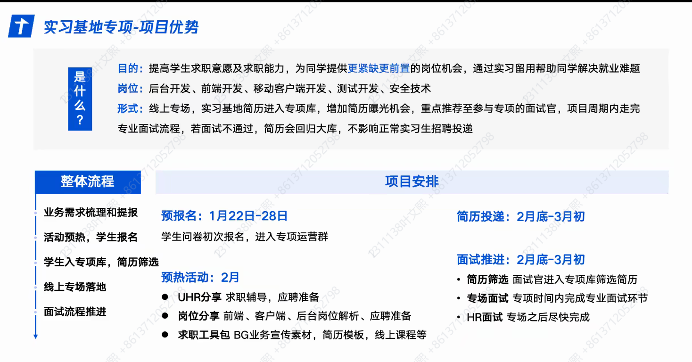
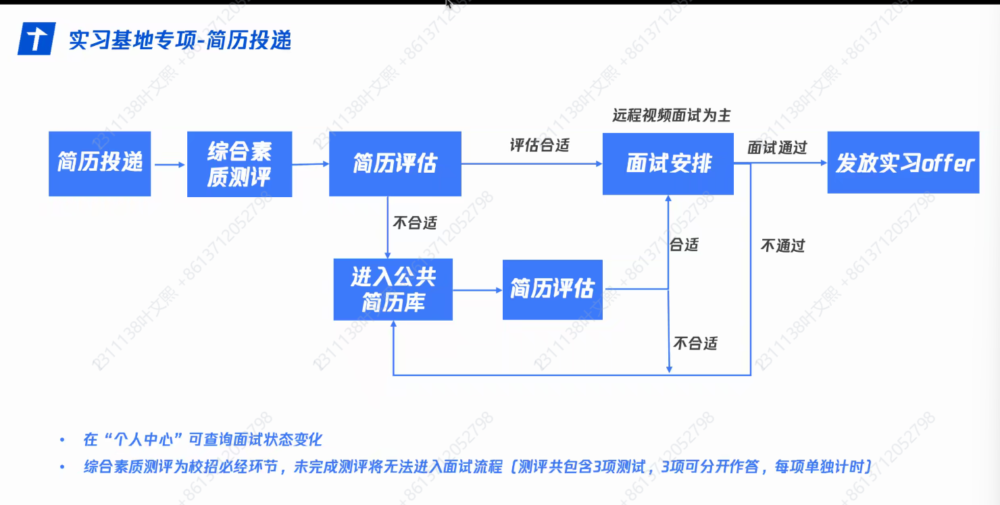
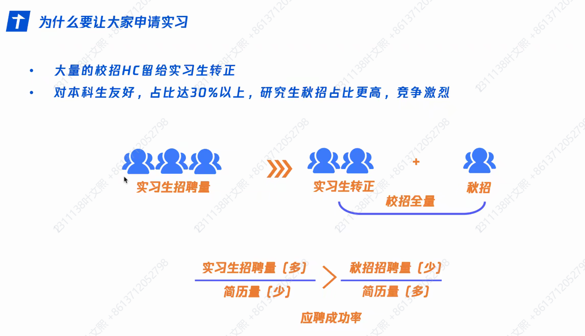
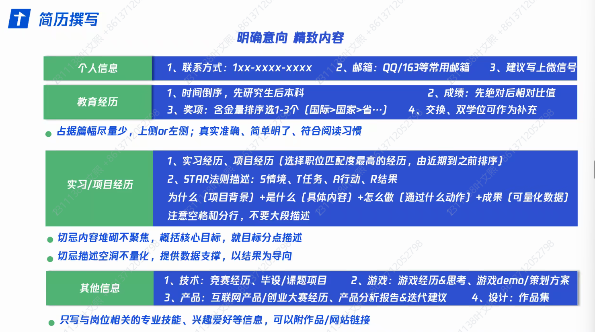
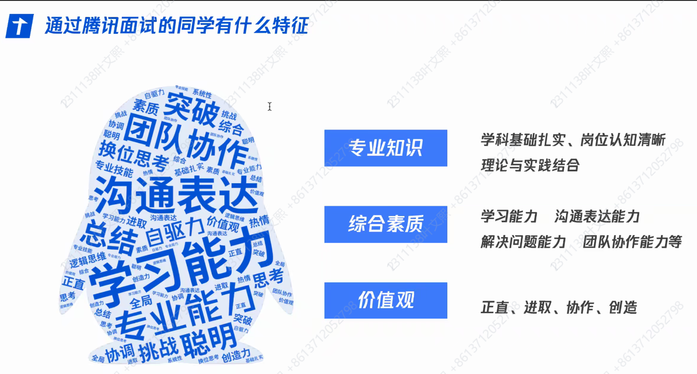
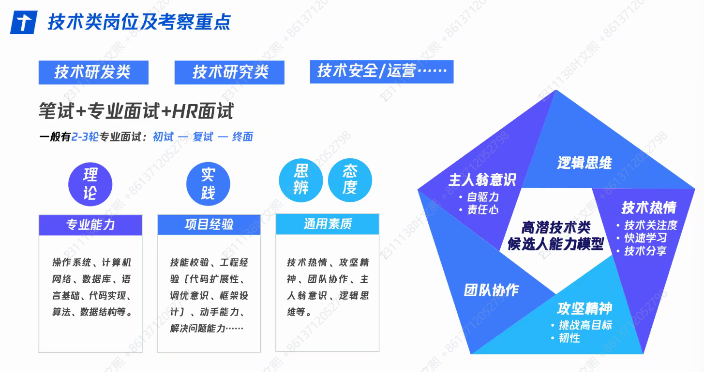
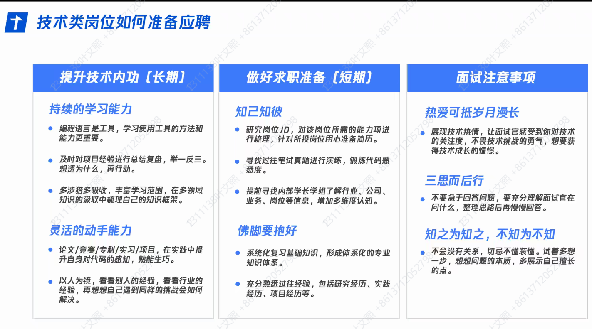

# 实习招聘

不管什么语言都能投递，欢迎转语言，注重语言背后的思想

**注意参加综合素质测评**

本科生和研究生一视同仁

# 简历

1. 个人信息占10%，重点检查邮箱，联系方式写清楚

2. 教育经历占30%，成绩好可以写GPA

3. 实习/项目经历：有实习优先写实习，无实习

   项目经历：可以写课设，但一定要注意**写产出**

明确投递岗位，将自身经历进行信息提炼和岗位匹配->将投递岗位写在简历开篇

简历照片选择：干净得体即可

履历信息：

1. 突出含金量高的地方，体现个人的竞争力
2. 概况工作的核心目标，做了什么动作，得到什么结果，以数据为支撑，以结果为导向
3. 实习经历按时间最近到远
4. 其他信息：个人技能，获奖信息，证书（选择一到三个进行呈现即可，如果兴趣与岗位匹配可以写兴趣）
5. 简历一页即可

简历格式转化为pdf格式

简历命名：姓名、应聘岗位、联系方式

## 模板

## Tips

内推和自己投递在流程上无特别区别

实习基地不做笔试

不做简历和笔试的筛选，取决于面试官综合评价

# 面试

面试的时候一定不要不懂装懂，要尽量体现自己的擅长部分

不要一直盯着面试官看，也不要一直低头

# 学到的

- 提前准备八股（牛客网）
- 介绍项目经历时，学会讲故事
  1. 自己为了什么需求学习/实现了什么，有什么产出，重视数据说明
  2. 遇到了什么难点，自己是如何解决的
  3. 体现自己的综合素质，例如团队精神，使用了chatgpt体现拥抱技术等等
- 今年（2025）至少几千
- 自动解析简历->把含金量高的往上放
- 当前招的是暑期实习，可以提前实习，线下实习，两个月为主
- 综合素质评价类似于公务员的行测
- 大部分岗位在深圳（70%）
- 越早投越好
- 转正比例50%以上

