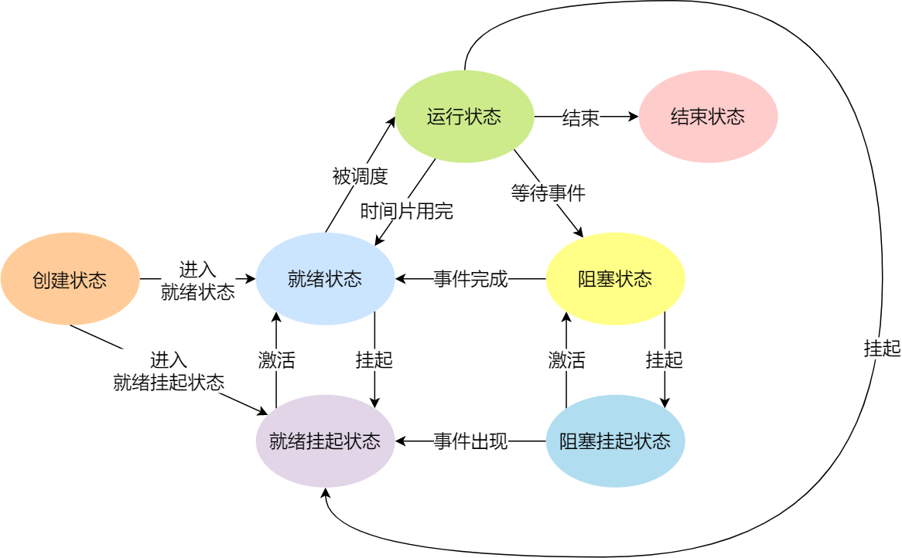

## 内存管理

## 进程管理

### 知识摘要

#### 进程

进程的定义：运行中的程序

**进程的状态**：

进程至少有三种状态：运行状态、就绪状态、阻塞状态

- 运行状态：该时刻进程占用CPU
- 就绪状态：进程可运行（等待调度），但由于其他进程处于运行状态而暂时停止运行
- 阻塞状态：进程正在等待某一事件的发生（如IO操作的完成）而暂时停止运行

完整状态

- 创建状态：进程正在被创建的状态
- 结束状态：进程正在从系统中消失的状态

由于阻塞状态不能随时被调度执行，大量的阻塞状态会浪费物理内存，因此在虚拟内存管理的操作系统中，通常将阻塞进程的物理内存空间换出到硬盘，等到需要再次运行的时候再从硬盘换入到物理内存

为了描述进程没有占用实际物理空间的情况，引入新的状态：挂起状态

导致进程挂起的原因还包括：

- 通过sleep让进程间歇挂起，其工作原理是设置一个定时器，到期后唤醒进程
- 用户希望挂起一个程序的执行

#### 线程

线程是进程中的一条执行流程

同一进程内多个线程之间可以共享代码段、数据段、打开的文件等资源，但每个线程各自拥有一套独立的寄存器和栈，从而保证线程的控制流相互独立

### 面试题

#### 并发和并行有什么区别？

并发：逻辑上具有同时处理多个任务的能力，但同一时间只能有一个任务在执行

并行：物理上具有同时处理多个任务的能力，同一时间可以有多个任务执行

#### **进程和线程的区别**

- **本质区别**：进程是操作系统资源分配的基本单位，而线程是任务调度和执行的基本单位
- **在开销方面**：每个进程都有独立的代码和数据空间（程序上下文），程序之间的切换会有较大的开销；线程可以看做轻量级的进程，同一类线程共享代码和数据空间，每个线程都有自己独立的运行栈和程序计数器（PC），线程之间切换的开销小
- **稳定性方面**：进程中某个线程如果崩溃了，可能会导致整个进程都崩溃。而进程中的子进程崩溃，并不会影响其他进程。
- **内存分配方面**：系统在运行的时候会为每个进程分配不同的内存空间；而对线程而言，除了CPU外，系统不会为线程分配内存（线程所使用的资源来自其所属进程的资源），线程组之间只能共享资源
- **包含关系**：没有线程的进程可以看做是单线程的，如果一个进程内有多个线程，则执行过程不是一条线的，而是多条线（线程）共同完成的；线程是进程的一部分，所以线程也被称为轻权进程或者轻量级进程

#### **为什么进程崩溃不会对其他进程产生很大影响**

主要是因为：

- **进程隔离性**：每个进程都有自己独立的内存空间，当一个进程崩溃时，其内存空间会被操作系统回收，不会影响其他进程的内存空间。这种进程间的隔离性保证了一个进程崩溃不会直接影响其他进程的执行。
- **进程独立性**：每个进程都是独立运行的，它们之间不会共享资源，如文件、网络连接等。因此，一个进程的崩溃通常不会对其他进程的资源产生影响。

#### 协程和线程比较

#### 进程之间有什么通信方式

每个进程的用户地址空间都是独立的，进程之间不能互相访问，而内核空间是进程共享的，因此进程之间通信要经过内核

进程的通信方式有

- 管道
- 消息队列
- 共享内存
- 信号量
- 信号
- Socket

**管道**

管道传输数据类型是单向的，要想相互通信需要创建两个管道

管道有两种类型：匿名管道和命名管道FIFO（数据先进先出）

> 匿名管道和命名管道的区别：
>
> - 匿名管道的通信是存在父子关系的进程，因为匿名管道没有实体，通过fork来复制父进程fd文件描述符来达到通信的目的
> - 命名管道可与在不相关的进程间相互通信，因为命名管道提前创建了一个类型为管道的设备文件，只要进程里使用这个设备文件就可以相互通信。

不管是匿名管道还是命名管道，进程写入的数据都是缓存在内核中，另一个进程读取数据时候自然也是从内核中获取，同时通信数据都遵循**先进先出**原则，不支持 lseek 之类的文件定位操作。

**消息队列**

消息队列是保存在内核的消息链表，发送数据时会将数据分成一个个数据单元，即消息体，消息体是发送方和接收方约定好的自定义的数据类型，每个消息体是固定的存储块（与管道无格式的字节流数据不同），如果进程从消息队列读取了消息体，内核就会把这个消息体删除

消息队列就是：进程A给进程B发消息，进程A把数据放在对应的消息队列之后正常返回，进程B需要的时候再去读取数据

> 与匿名管道不同，消息队列随内核存在，而匿名管道随进程存在

消息队列缺点：

1. 通信不及时
2. 附件有大小限制，不适合大数据的传输
3. 通信过程存在用户态与内核态之间的拷贝开销

**共享内存**

不同进程不同虚拟页，映射到相同的物理内存中，因此进程之间通信不需要经过内核态

> 如果某进程想要修改这块共享内存区域，会触发访问权限异常，操作系统会将异常对应的物理页拷贝一份，新拷贝的物理页以可读可写的权限提供给触发异常的物理页（只拷贝修改部分所在的物理页，其余共享内存区域仍然只读）

**信号量**

为了防止多进程竞争共享资源造成数据错乱，信号量作为一个整型的计数器，实现进程间的互斥与同步

信号量表示资源的数量，控制信号量的方式有两种原子操作：

- 一个是 **P 操作**，这个操作会把信号量减去 1，相减后如果信号量 < 0，则表明资源已被占用，进程需阻塞等待；相减后如果信号量 >= 0，则表明还有资源可使用，进程可正常继续执行。
- 另一个是 **V 操作**，这个操作会把信号量加上 1，相加后如果信号量 <= 0，则表明当前有阻塞中的进程，于是会将该进程唤醒运行；相加后如果信号量 > 0，则表明当前没有阻塞中的进程；

P 操作是用在进入共享资源之前，V 操作是用在离开共享资源之后，这两个操作是必须成对出现的。

**多进程互斥初始化信号量为 `1`**

**多进程同步初始化信号量为 `0`**

**信号**

进程间通信，都是常规状态下的工作模式

异常情况下的工作模式需要用「信号」的方式来通知进程

信号是进程间通信机制中**唯一的异步通信机制**，因为可以在任何时候发送信号给某一进程，一旦有信号产生，我们就有下面这几种，用户进程对信号的处理方式。

**1.执行默认操作**。Linux 对每种信号都规定了默认操作，例如，上面列表中的 SIGTERM 信号，就是终止进程的意思。

**2.捕捉信号**。我们可以为信号定义一个信号处理函数。当信号发生时，我们就执行相应的信号处理函数。

**3.忽略信号**。当我们不希望处理某些信号的时候，就可以忽略该信号，不做任何处理。有两个信号是应用进程无法捕捉和忽略的，即 `SIGKILL` 和 `SEGSTOP`，它们用于在任何时候中断或结束某一进程。

**Socket**

前面提到的管道、消息队列、共享内存、信号量和信号都是在同一台主机上进行进程间通信，那要想**跨网络与不同主机上的进程之间通信，就需要 Socket 通信了。**

实际上，Socket 通信不仅可以跨网络与不同主机的进程间通信，还可以在同主机上进程间通信。

> 针对 TCP 协议通信的 socket 编程模型

- 服务端和客户端初始化 `socket`，得到文件描述符；
- 服务端调用 `bind`，将绑定在 IP 地址和端口;
- 服务端调用 `listen`，进行监听；
- 服务端调用 `accept`，等待客户端连接；
- 客户端调用 `connect`，向服务器端的地址和端口发起连接请求；
- 服务端 `accept` 返回用于传输的 `socket` 的文件描述符；
- 客户端调用 `write` 写入数据；服务端调用 `read` 读取数据；
- 客户端断开连接时，会调用 `close`，那么服务端 `read` 读取数据的时候，就会读取到了 `EOF`，待处理完数据后，服务端调用 `close`，表示连接关闭。

这里需要注意的是，服务端调用 `accept` 时，连接成功了会返回一个已完成连接的 socket，后续用来传输数据。

所以，监听的 socket 和真正用来传送数据的 socket，是「**两个**」 socket，一个叫作**监听 socket**，一个叫作**已完成连接 socket**。

成功连接建立之后，双方开始通过 read 和 write 函数来读写数据，就像往一个文件流里面写东西一样。

> 针对 UDP 协议通信的 socket 编程模型

UDP 是没有连接的，所以不需要三次握手，也就不需要像 TCP 调用 listen 和 connect，但是 UDP 的交互仍然需要 IP 地址和端口号，因此也需要 bind。

对于 UDP 来说，不需要要维护连接，那么也就没有所谓的发送方和接收方，甚至都不存在客户端和服务端的概念，只要有一个 socket 多台机器就可以任意通信，因此每一个 UDP 的 socket 都需要 bind。

另外，每次通信时，调用 sendto 和 recvfrom，都要传入目标主机的 IP 地址和端口。

> 针对本地进程间通信的 socket 编程模型

本地 socket 被用于在**同一台主机上进程间通信**的场景：

- 本地 socket 的编程接口和 IPv4 、IPv6 套接字编程接口是一致的，可以支持「字节流」和「数据报」两种协议；
- 本地 socket 的实现效率大大高于 IPv4 和 IPv6 的字节流、数据报 socket 实现；

对于本地字节流 socket，其 socket 类型是 AF_LOCAL 和 SOCK_STREAM。

对于本地数据报 socket，其 socket 类型是 AF_LOCAL 和 SOCK_DGRAM。

本地字节流 socket 和 本地数据报 socket 在 bind 的时候，不像 TCP 和 UDP 要绑定 IP 地址和端口，而是**绑定一个本地文件**，这也就是它们之间的最大区别。

**关于线程的补充**

同个进程下的线程之间都是共享进程的资源，只要是共享变量都可以做到线程间通信，比如全局变量，所以对于线程间关注的不是通信方式，而是关注多线程竞争共享资源的问题，信号量也同样可以在线程间实现互斥与同步：

- 互斥的方式，可保证任意时刻只有一个线程访问共享资源；
- 同步的方式，可保证线程 A 应在线程 B 之前执行；

#### 线程之间共享哪些资源

- 代码段
- 数据段
- 堆空间
- 打开的文件

不共享的资源

- 寄存器
- 栈

#### 线程同步的方法

- 互斥锁
- 条件变量
- 读写锁
- 信号量

#### 什么是悲观锁、乐观锁

## 调度算法

## 网络系统

### 什么是同步、异步、阻塞、非阻塞

同步和异步的区别：请求发出后，是否需要等待结果，才能继续执行其他操作。

**同步：**发出一个功能调用时，在没有得到结果之前，该调用就不返回或继续执行后续操作。 简单来说，同步就是必须一件一件事做，等前一件做完了才能做下一件事。 

**异步：**当一个异步过程调用发出后，调用者在没有得到结果之前，就可以继续执行后续操作。当这个调用完成后，一般通过状态、通知和回调来通知调用者。对于异步调用，调用的返回并不受调用者控制。

**阻塞：**如果进程调用阻塞型I/O，调用后，进程会被挂起，直到I/O操作完成

**非阻塞：**如果进程调用非阻塞型I/O，调用后，系统内核会立刻返回（无论当前I/O是否获取到文件内容数据），进程不会被挂起，从而能够进行其他操作

另外补充：

- **同步阻塞I/O**：用户线程发起 read 调用后就阻塞了，让出 CPU。内核等待网卡数据到来，把数据从网卡拷贝到内核空间，接着把数据拷贝到用户空间，再把用户线程叫醒。
- **同步非阻塞I/O**：用户线程不断的发起 read 调用，数据没到内核空间时，每次都返回失败，直到数据到了内核空间，这一次 read 调用后，**在等待数据从内核空间拷贝到用户空间这段时间里，线程还是阻塞的**，等数据到了用户空间再把线程叫醒。
- **异步I/O**：用户线程发起 read 调用的同时注册一个回调函数，read 立即返回，等内核将数据准备好后，再调用指定的回调函数完成处理。在这个过程中，用户线程一直没有阻塞。

### I/O 多路复用：select/poll/epoll

#### Socket模型

Socket模型只能支持一对一通信

Socket的意思为“插口”，也就是在客户端和服务端的应用层和运输层之间开一个口子，双方读取和发送数据的时候都通过这个口子

创建Socket可以指定网络层使用的是ipv4还是ipv6，传输层使用的是TCP还是UDP

**TCP Socket**

构造连接过程：

1. 服务端创建一个Socket，指定网络协议为ipv4，以及传输协议为TCP，接着调用bind函数，给这个Socket绑定一个IP地址和端口
   - 绑定端口号能够找到对应的应用程序
   - 绑定IP地址：一台设备可拥有多个网卡，每个网卡都有对应的IP地址，Socket绑定某个网卡对应的IP地址后，内核收到该网卡上的包才会发给我们
2. 服务端调用listen函数进行监听，对应listen状态
3. 服务端进入监听状态后，调用accept函数来从内核获取客户端的连接，如果没有客户端连接的到来，会阻塞等待客户端的到来
4. 客户端创建一个Socket后，调用connet函数发起连接，该函数参数要指明服务端的IP地址和端口号，然后开始TCP三次握手建立连接
5. TCP连接过程中，服务端的内核会维护两个队列：半连接队列和全连接队列
   - 半连接队列存储还没有完成三次握手的Socket，服务端处于SYN-RCVD状态
   - 全连接队列存储完成三次握手的Socket，服务端处于ESTABLISH状态
6. 当服务端的全连接队列不为空，服务端的accept函数就会从内核中的TCP全连接队列中拿出一个已经完成连接的Socket返回应用程序，之后的数据传输都使用这个Socket
7. 连接建立后，客户端和服务端开始相互传输数据，服务端调用read读取数据，客户端用write发出数据

注意：服务端监听的Socket和最后调用accept获得的已连接Socket是两个不同的Socket

#### 多进程模型

> Socket模型只能进行一对一通信，使用的是同步阻塞的方式，当服务端还没处理完一个客户端的网络I/O或者读写操作发送阻塞时，其他客户端无法与服务端连接
>
> 这样会导致服务端只能服务于一个客户，浪费资源
>
> 理论上，服务端能够服务 IP地址数x端口数，即ipv4协议下$2^{32}$x$2^{16}$
>
> 但实际上服务器承载不了这么多连接数，受到两方面约束
>
> - 文件描述符：Socket本质上是一个文件，对应一个文件描述符，Linux对单个进程打开的文件描述符数有限制，一般是1024个
> - 系统内存：每个TCP连接在内核中都有对应的数据结构，意味着每个连接都会占用内存

多进程模型：服务端为每个客户端分配一个进程来处理请求

服务端的主进程负责监听客户的连接，一旦与客户端连接完成，accept函数就会返回一个已连接Socket，这时候就通过fork函数创建一个子进程，将父进程的所有资源复制一份

> 父子进程通过返回值区分：子进程返回值为0，返回值为其他整数则为父进程

子进程复制了父进程的文件描述符，包括已连接Socket的文件描述符，因此子进程也能与客户端进行通信。子进程不需要关心「监听 Socket」，只需要关心「已连接 Socket」；父进程则相反，将客户服务交给子进程来处理，因此父进程不需要关心「已连接 Socket」，只需要关心「监听 Socket」

多进程模型存在显著的缺点：每产生一个进程就会占用一定的系统资源，并且进程上下文切换开销很大。这些缺点非常不便于服务大量客户端。

##### 僵尸进程和孤立进程

> 在Linux里，除了进程0（即PID=0的进程）以外的所有进程都是由其他进程使用系统调用fork创建的，这里调用fork创建新进程的进程即为父进程，而相对应的为其创建出的进程则为子进程，因而除了进程0以外的进程都只有一个父进程，但一个进程可以有多个子进程。
>
> 但是子进程的结束和父进程的运行是一个异步过程，即父进程永远无法预测子进程到底什么时候结束。当一个进程完成它的工作终止之后，它的父进程需要调用wait()或者waitpid()系统调用取得子进程的终止状态

**僵尸进程**

当一个子进程结束运行（一般是调用exit、运行时发生致命错误或收到终止信号所导致）时，子进程的退出状态（返回值）会回报给操作系统，系统则以SIGCHLD信号将子进程被结束的事件告知父进程，此时子进程的进程控制块（PCB）仍驻留在内存中。

一般来说，收到SIGCHLD后，父进程会使用wait系统调用以获取子进程的退出状态，然后内核就可以从内存中释放已结束的子进程的PCB；而如**若父进程没有这么做的话，子进程的PCB就会一直驻留在内存中，也即成为僵尸进程**

僵尸进程会浪费内存

**孤儿进程**

孤儿进程则是指当一个父进程退出，而它的一个或多个子进程还在运行，那么那些子进程将成为孤儿进程。孤儿进程将被init进程(进程号为1)所收养，并由init进程对它们完成状态收集工作。

孤儿进程由于有init进程循环的wait()回收资源，因此并没有什么危害

#### 多线程模型

当服务器与客户端 TCP 完成连接后，通过 `pthread_create()` 函数创建线程，然后将「已连接 Socket」的文件描述符传递给线程函数，接着在线程里和客户端进行通信，从而达到并发处理的目的。

如果每来一个连接就创建一个线程，线程运行完后，还得操作系统还得销毁线程，虽说线程切换的上写文开销不大，但是如果频繁创建和销毁线程，系统开销也是不小的。

那么，我们可以使用**线程池**的方式来避免线程的频繁创建和销毁，所谓的线程池，就是提前创建若干个线程，这样当由新连接建立时，将这个已连接的 Socket 放入到一个队列里，然后线程池里的线程负责从队列中取出「已连接 Socket 」进行处理。

多线程模型仍然无法很好地支持多连接问题

#### I/O多路复用

多进程模型&多线程模型的缺点本质上都是在于对每个请求都分配一个进程/线程

那么我们联想到使用一个进程来维护多个Socket，这就是I/O多路复用

类似于CPU的并发，I/O多路复用使用一个进程对每个请求分配时间片。

##### select/poll

select 实现多路复用的方式是，将已连接的 Socket 都放到一个**文件描述符集合**，然后调用 select 函数将文件描述符集合**拷贝**到内核里，让内核来检查是否有网络事件产生，检查的方式很粗暴，就是通过**遍历**文件描述符集合的方式，当检查到有事件产生后，将此 Socket 标记为可读或可写， 接着再把整个文件描述符集合**拷贝**回用户态里，然后用户态还需要再通过**遍历**的方法找到可读或可写的 Socket，然后再对其处理。

所以，对于 select 这种方式，需要进行 **2 次「遍历」文件描述符集合**，一次是在内核态里，一个次是在用户态里 ，而且还会发生 **2 次「拷贝」文件描述符集合**，先从用户空间传入内核空间，由内核修改后，再传出到用户空间中。

select 使用固定长度的 BitsMap，表示文件描述符集合，而且所支持的文件描述符的个数是有限制的，在 Linux 系统中，由内核中的 FD_SETSIZE 限制， 默认最大值为 `1024`，只能监听 0~1023 的文件描述符。

poll 不再用 BitsMap 来存储所关注的文件描述符，取而代之用动态数组，以链表形式来组织，突破了 select 的文件描述符个数限制，当然还会受到系统文件描述符限制。

但是 poll 和 select 并没有太大的本质区别，**都是使用「线性结构」存储进程关注的 Socket 集合，因此都需要遍历文件描述符集合来找到可读或可写的 Socket，时间复杂度为 O(n)，而且也需要在用户态与内核态之间拷贝文件描述符集合**，这种方式随着并发数上来，性能的损耗会呈指数级增长。

##### epoll

*第一点*，epoll 在内核里使用**红黑树来跟踪进程所有待检测的文件描述字**，把需要监控的 socket 通过 `epoll_ctl()` 函数加入内核中的红黑树里，红黑树是个高效的数据结构，增删改一般时间复杂度是 `O(logn)`。而 select/poll 内核里没有类似 epoll 红黑树这种保存所有待检测的 socket 的数据结构，所以 select/poll 每次操作时都传入整个 socket 集合给内核，而 epoll 因为在内核维护了红黑树，可以保存所有待检测的 socket ，所以只需要传入一个待检测的 socket，减少了内核和用户空间大量的数据拷贝和内存分配。

*第二点*， epoll 使用**事件驱动**的机制，内核里**维护了一个链表来记录就绪事件**，当某个 socket 有事件发生时，通过**回调函数**内核会将其加入到这个就绪事件列表中，当用户调用 `epoll_wait()` 函数时，只会返回有事件发生的文件描述符的个数，不需要像 select/poll 那样轮询扫描整个 socket 集合，大大提高了检测的效率。

epoll 的方式即使监听的 Socket 数量越多的时候，效率不会大幅度降低，能够同时监听的 Socket 的数目也非常的多了，上限就为系统定义的进程打开的最大文件描述符个数。因而，**epoll 被称为解决 C10K 问题的利器**。

###### 边缘触发和水平触发

**边缘触发：**当被监控的Socket描述符上有可读事件发生时，服务器端只会从epoll_wait中苏醒一次，即使进程没有调用 read 函数从内核读取数据，也依然只苏醒一次，因此我们程序要保证一次性将内核缓冲区的数据读取完

**水平触发：**当被监控的Socket描述符上有可读事件发生时，服务器端不断从epoll_wait中苏醒，直到内核缓冲区数据被read函数读完才结束

边缘触发模式一般和**非阻塞I/O**搭配使用

**边缘触发比水平触发效率高**，因为边缘触发可以减少epoll_wait 的系统调用次数，系统调用也是有一定的开销的的，毕竟也存在上下文的切换。

select/poll 只有水平触发模式，epoll 默认的触发模式是水平触发，但是可以根据应用场景设置为边缘触发模式。

另外，使用 I/O 多路复用时，最好搭配非阻塞 I/O 一起使用