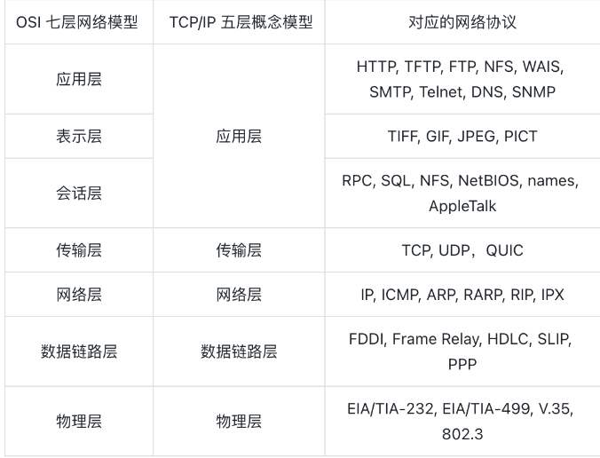
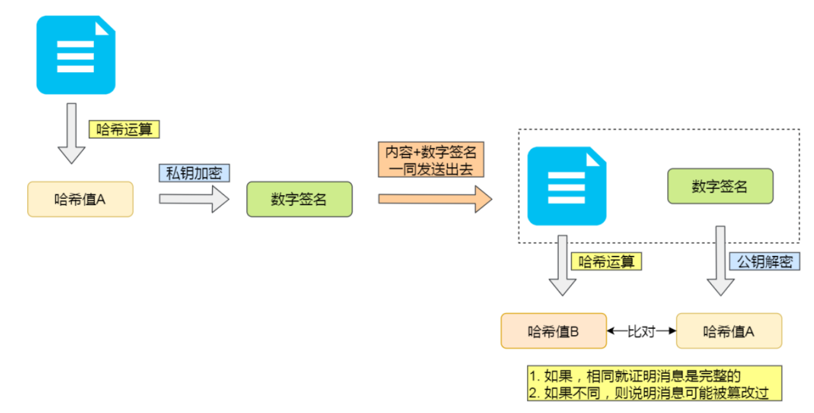
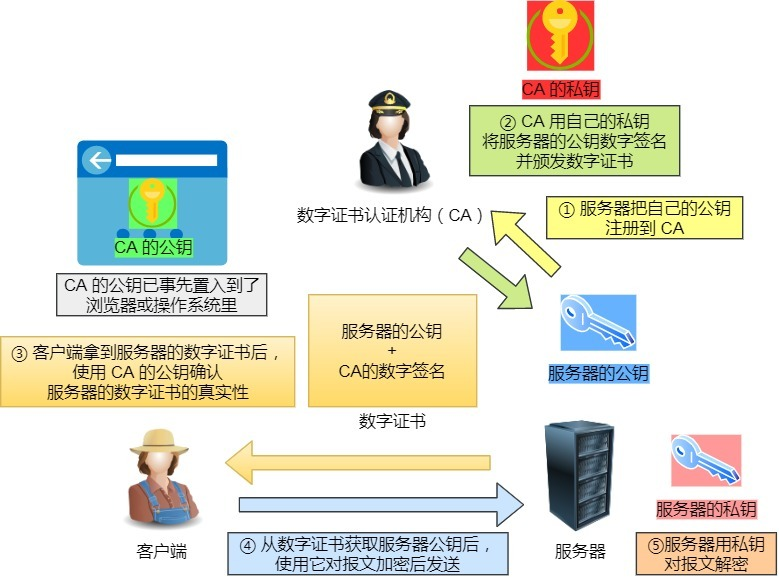
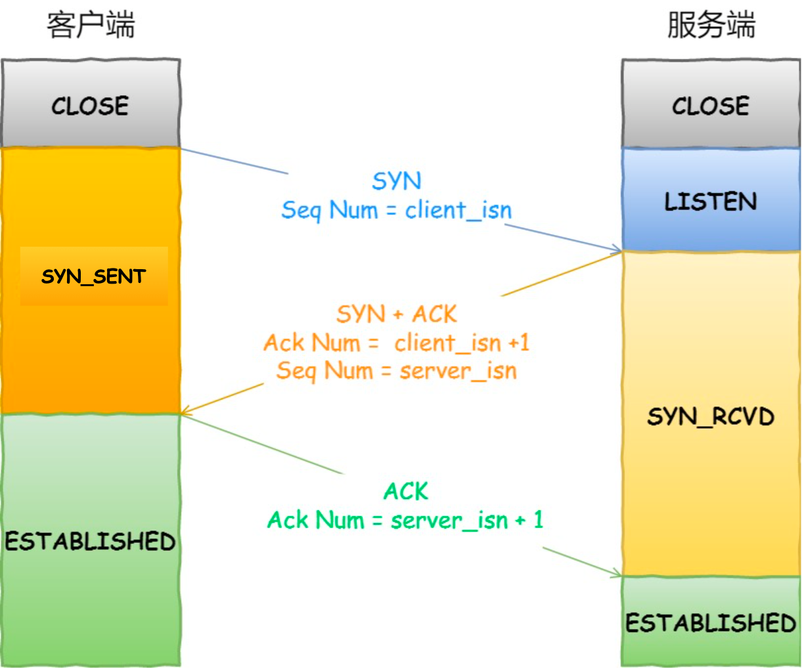
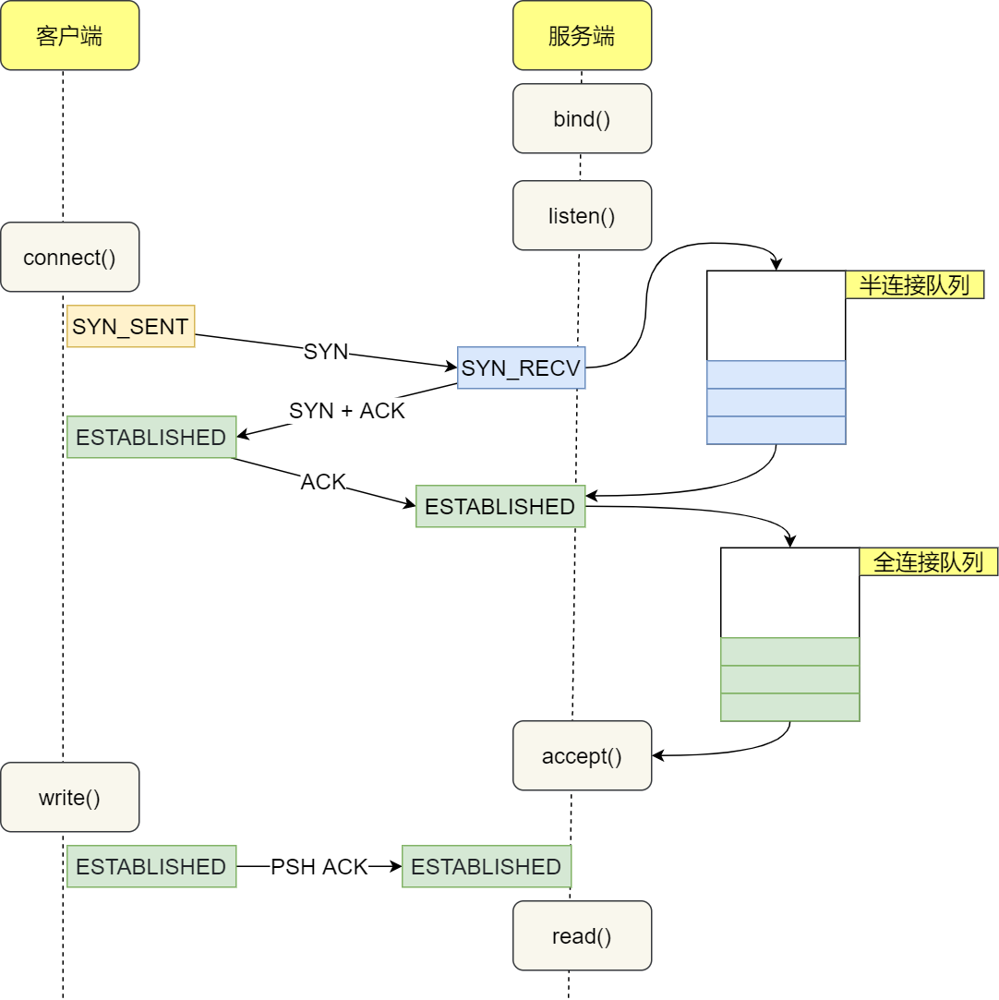
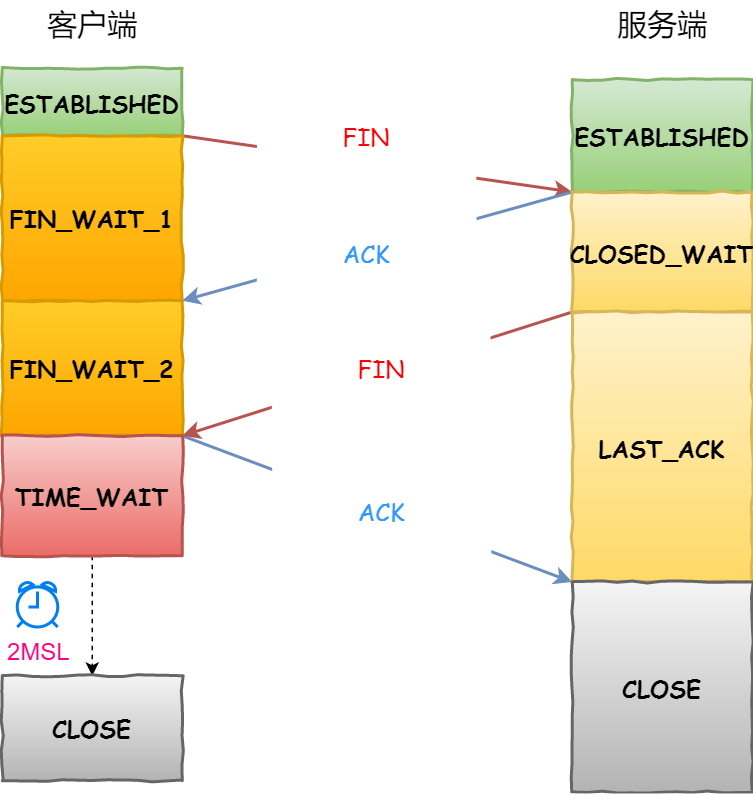

> 本文档是针对常见面试题总结自己的答案
>
> 如果想要更深入了解，可以在小林coding搜索对应的问题或者自行搜索

## 网络基础篇

### 知识摘要

#### 计算机网络体系结构

计算机网络体系结构有多种分类方法，常见的分类有OSI七层模型，五层协议模型，TCP/IP模型


##### OSI七层模型

OSI（Open System Interconnection Reference Model）模型是国际化标准化组织ISO（International Organization for Standardization）提出的一个试图使各种计算机在世界范围内连为网络的标准框架。

> 可以将OSI七层模型理解为计算机专家所制定的计算机网络的法律框架

OSI模型将计算机网络分为七层：

- 应用层：通过应用程序之间的交互来完成特定的网络应用
- 表示层：解释交换数据的含义。该层提供的服务主要包括服务压缩，数据加密以及数据描述
- 会话层：负责建立、管理和终止表示层实体之间的通信会话。该层提供了数据交换的定界和同步功能，包括了建立检查点和恢复方案的方法。
- 传输层：负责因特网中两台主机的进程提供通信服务。
- 网络层：选择合适的网间路由和交换节点，确保数据按时成功传送。
- 数据链路层：数据链路层将网络层交下来的IP数据报组装成帧，在两个相邻节点间的链路上传送帧。
- 物理层：实现计算机节点之间比特流的透明传送，尽可能屏蔽掉具体传输介质和物理设备的差异。

##### 五层协议

> OSI模型失败原因：
>
> - OSI制定标准的周期太长
> - OSI模型实现复杂、允许效率低
> - OSI的层次划分不太合理，有些功能在多个层次中重复出现

五层协议模型在OSI模型基础上对会话层和表示层归入应用层。

五层协议模型包括：

- 应用层：负责**应用程序**之间的通信，但是并不关注数据如何传输（类似于我们将快递交给快递员，由快递员传输快递），应用层将应用数据交给下一层（快递员），也就是传输层
- 传输层：负责**应用进程**之间的通信。通过端口号识别同一台设备上的不同进程。
- 网络层：负责**端系统（主机）**之间的通信，处理**多个网络**之间的通信
- 数据链路层：负责**点到点**的通信，处理**单个网络（通常是以太网）**之间的通信
  - **点到点**指：主机到相邻链路交换机，链路交换机与相邻的链路交换机之间）
- 物理层：将通信信息的数字信号转换为电信号，在物理介质之间传到目的物理层，再将接收到的物理信号转变为电信号。

##### TCP/IP模型

> 由于因特网的广泛使用，TCP/IP模型是计算机网络的市场标准

TCP/IP模型在五层模型的基础上再进行简化，将数据链路层和物理层归纳为数据接口层，因此TCP/IP共有4层：

- 应用层
- 传输层
- 网络层
- 网络接口层

每一层功能与五层协议相对应，此处不再赘述。

### 面试题

#### 计算机网络为什么要分层？

1. **为了让各层之间相互独立。**各层之间相互独立，各层不需要关注其他层是如何实现的，只需要知道自己如何调用下一层提供的功能。*这与我们后台开发时对复杂系统进行分层是一个道理。*
2. **为了提高整体灵活性。**每一层都可以使用最适合的技术去实现，只需要保证该层提供的功能和暴露的接口的规则没有改变就行。*这与我们平时开发系统要求的高内聚、低耦合的原则对应。*
3. **为了将复杂问题分解为多个简单的问题。**分层可以将复杂的网络问题分解为许多小的，界线比较清晰简单的小问题来处理和解决，这样使得复杂的计算机网络系统变得易于设计，实现和标准化。*我们后台开发时，一般会将系统功能分解，将复杂的问题分解为容易理解的小问题，这些问题具有更好地边界定义*

#### 计算机网络是怎么分层的？

计算机网络常见的分层模型有三种：OSI模型，五层协议模型以及TCP/IP模型

**OSI模型**共七层，包括：应用层、表示层、会话层、传输层、网络层、数据链路层、物理层

**五层模型**共五层，包括：应用层、传输层、网络层、数据链路层、物理层

**TCP/IP模型**共四层，包括：应用层、传输层、网络层、网络接口层

#### 三种计算机网络模型的关系是什么？各层协议？

五层模型将OSI模型的表示层和会话层归入了应用层

TCP/IP模型将五层模型的数据链路层和物理层归纳为网络接口层

应用层协议：HTTP、FTP、DNS、SMTP、Telnet

表示层协议：JPEG、MPEG、ASII

会话层协议：NFS、SQL、RPC

传输层协议：TCP、UDP、QUIC

网络层协议：IP、ICMP、RARP、ARP、OSPF、RIP

数据链路层协议：MAC、PPP

物理层协议：IEEE802.3、CLOCK



#### 计算机网络中，数据如何在各层中传播？数据在网络各层中的存在形式是怎么样的？

以TCP/IP模型为例：

1. 某进程在应用层准备好待传输数据，若目的地址是域名，则要先通过DNS解析成IP地址
2. 将待传输数据通过Socket将数据交付到传输层（TCP/UDP层），
   - 如果是TCP层
   - 如果是UDP层
3. 将报文段交付到网络层
4. 将数据报交付给数据接口层
5. 数据接口层，最后将其以电信号形式发出

#### OSI，TCP/IP，五层协议的体系结构，以及各层协议？

**OSI模型**共七层，包括：应用层、表示层、会话层、传输层、网络层、数据链路层、物理层

**五层模型**共五层，包括：应用层、传输层、网络层、数据链路层、物理层

**TCP/IP模型**共四层，包括：应用层、传输层、网络层、网络接口层

应用层协议：HTTP、FTP、DNS、SMTP、Telnet

表示层协议：JPEG、MPEG、ASII

会话层协议：NFS、SQL、RPC

传输层协议：TCP、UDP、QUIC

网络层协议：IP、ICMP、ARP、OSPF、RIP

数据链路层协议：MAC、PPP

物理层协议：IEEE802.3、CLOCK

> 知识补充：
>
> 

#### 重点：键入网页到网页显示，期间发生了什么

## HTTP篇

### 面试题

#### 能否详细解释「超文本传输协议」？

HTTP是超文本传输协议，我们可以将其拆成三部分理解：

- 超文本
- 传输
- 协议

**协议：**

- 「**协**」字表示必须有两个以上的参与者
- 「**议**」字表示对参与者的一种行为约定与规范

因此我们可以理解为：HTTP是计算机网络的协议，它用计算机能够理解的语言确立了一种计算机之间交流通信的规范，以及相关的各种控制的错误处理方式

**超文本：**

文本指的是文字、图片、视频、压缩包等，而超文本的英文为HyperText，意思是超越文本的文本，它是文字、图片、视频的混合体，它的“超越”体现在超文本具有超链接，能够从一个超文本跳转到另一个超文本。

**传输：**

传输一词的意思就是将信息由A传到B，或者由B传到A，表明了两个重要信息：

- HTTP是双向协议
- 数据传输允许中间有中转或接力

综上所述，超文本传输协议是一个计算机世界专门在**两点**之间**传输**文字、图片、视频等**超文本**数据的**约定和规范**

#### 那「HTTP 是用于从互联网服务器传输超文本到本地浏览器的协议」，这种说法正确吗？

不正确。因为可以是服务器与服务器之间传输超文本，因此将HTTP描述为：”HTTP是两点之间传输超文本的协议“比较准确。

#### HTTP常见的状态码有哪些？


`1xx` 类状态码属于**提示信息**，是协议处理中的一种中间状态，实际用到的比较少。

`2xx` 类状态码表示服务器**成功**处理了客户端的请求，也是我们最愿意看到的状态。

- 「**200 OK**」是最常见的成功状态码，表示一切正常。如果是非 `HEAD` 请求，服务器返回的响应头都会有 body 数据。

  > HEAD请求是HTTP协议中的一种请求方法，与GET请求类似，但不返回实际的响应主体。它主要用于获取资源的元数据，检查资源是否存在以及验证资源是否被修改。

- 「**204 No Content**」也是常见的成功状态码，与 200 OK 基本相同，但响应头没有 body 数据。

- 「**206 Partial Content**」是应用于 HTTP 分块下载或断点续传，表示响应返回的 body 数据并不是资源的全部，而是其中的一部分，也是服务器处理成功的状态。

`3xx` 类状态码表示客户端请求的资源发生了变动，需要客户端用新的 URL 重新发送请求获取资源，也就是**重定向**。

- 「**301 Moved Permanently**」表示永久重定向，说明请求的资源已经不存在了，需改用新的 URL 再次访问。
- 「**302 Found**」表示临时重定向，说明请求的资源还在，但暂时需要用另一个 URL 来访问。

301 和 302 都会在响应头里使用字段 `Location`，指明后续要跳转的 URL，浏览器会自动重定向新的 URL。

- 「**304 Not Modified**」不具有跳转的含义，表示资源未修改，重定向已存在的缓冲文件，也称缓存重定向，也就是告诉客户端可以继续使用缓存资源，用于缓存控制。

`4xx` 类状态码表示客户端发送的**报文有误**，服务器无法处理，也就是错误码的含义。

- 「**400 Bad Request**」表示客户端请求的报文有错误，但只是个笼统的错误。
- 「**403 Forbidden**」表示服务器禁止访问资源，并不是客户端的请求出错。
- 「**404 Not Found**」表示请求的资源在服务器上不存在或未找到，所以无法提供给客户端。

`5xx` 类状态码表示客户端请求报文正确，但是**服务器处理时内部发生了错误**，属于服务器端的错误码。

- 「**500 Internal Server Error**」与 400 类型，是个笼统通用的错误码，服务器发生了什么错误，我们并不知道。
- 「**501 Not Implemented**」表示客户端请求的功能还不支持，类似“即将开业，敬请期待”的意思。
- 「**502 Bad Gateway**」通常是服务器作为网关或代理时返回的错误码，表示服务器自身工作正常，访问后端服务器发生了错误。
- 「**503 Service Unavailable**」表示服务器当前很忙，暂时无法响应客户端，类似“网络服务正忙，请稍后重试”的意思。      

#### HTTP 常见字段有哪些？

- *Host* 字段
- *Content-Length 字段*
- *Connection 字段*
- *Content-Type 字段*
- *Content-Encoding 字段*

***Host* 字段**

客户端发送请求时用来指明服务器的域名

> 有了 `Host` 字段，就可以将请求发往「同一台」服务器上的不同网站。

***Content-Length 字段***

服务器在返回数据时，会有 `Content-Length` 字段，表明本次回应的数据长度（单位为字节）

> HTTP 协议通过设置回车符、换行符作为 HTTP header 的边界，通过 Content-Length 字段作为 HTTP body 的边界，这两个方式都是为了解决“粘包”的问题。

***Connection 字段***

`Connection` 字段最常用于客户端要求服务器使用「HTTP 长连接」机制，以便其他请求复用。

> HTTP/1.1 版本的默认连接都是长连接，但为了兼容老版本的 HTTP，需要指定 `Connection` 首部字段的值为 `Keep-Alive`。
>
> 开启了 HTTP Keep-Alive 机制后， 连接就不会中断，而是保持连接。当客户端发送另一个请求时，它会使用同一个连接，一直持续到客户端或服务器端提出断开连接。

***Content-Type 字段***

`Content-Type` 字段用于服务器回应时，告诉客户端，本次数据是什么格式。

客户端请求的时候，可以使用 `Accept` 字段声明自己可以接受哪些数据格式。

> ```
> Content-Type: text/html; Charset=utf-8
> ```
>
> 上面的类型表明，发送的是网页，而且编码是UTF-8。
>
> ```
> Accept: */*
> ```
>
> 上面代码中，客户端声明自己可以接受任何格式的数据。

***Content-Encoding 字段***

`Content-Encoding` 字段说明数据的压缩方法。表示服务器返回的数据使用了什么压缩格式

客户端在请求时，用 `Accept-Encoding` 字段说明自己可以接受哪些压缩方法。

> ```text
> Content-Encoding: gzip
> ```
>
> 上面表示服务器返回的数据采用了 gzip 方式压缩，告知客户端需要用此方式解压。
>
> ```text
> Accept-Encoding: gzip, deflate
> ```

#### Get与Post有什么区别？

**语义不同：**

- GET是从服务器获取指定的资源
- POST时根据请求负荷对指定的资源做出处理，具体的处理方式视资源类型而不同

**参数要求不同：**

GET:

- GET请求的参数位置一般是写在URL中，URL规定只能支持ASCII，所以GET请求的参数只允许ASCII字符
- 浏览器对URL的长度有限制，从而对参数长度有限制

POST:

- POST请求的参数一般写在报文body中，body中的数据可以是任意格式的数据，只要客户端与服务器协商好即可
- 浏览器不会对body大小做限制

> GET与POST查询参数都可以放在body或者URL中，只是GET请求语义是获取资源，因此不需要用到body；POST语义是对资源进行处理，所以用到body

**安全性和幂等性不同：**

> 在HTTP协议里，”安全“ 指请求方法不会**破坏**服务器上的资源
>
> ”幂等“指：多次执行相同的操作，结构都是相同的

- GET通常是安全且幂等的，因为GET是「只读」操作，无论操作多少次，服务器上的数据都是安全的，且每次结果都是相同的，因此可以对GET请求的数据做缓存。
- POST通常是不安全且不幂等的，因为POST是「新增或提交数据」的操作，会修改服务器上的资源，所以是**不安全**的；且多次提交数据会创建多个资源，所以**不是幂等**的

> 实际过程中，开发者不一定会按照 RFC 规范定义的语义来实现 GET 和 POST 方法。比如：
>
> - 可以用 GET 方法实现新增或删除数据的请求，这样实现的 GET 方法自然就不是安全和幂等。
> - 可以用 POST 方法实现查询数据的请求，这样实现的 POST 方法自然就是安全和幂等。

#### HTTP 与 HTTPS 有哪些区别？

- HTTP是超文本传输协议，信息是明文传输，存在安全风险的问题。HTTPS则解决了HTTP不安全的缺陷，在TCP和HTTP网络层之间加入了SSL/TLS安全协议，使得报文能够加密传输
- HTTP连接建立相对简单，TCP三次握手之后便可进行HTTP的报文传输。而HTTPS在TCP三次握手之后，还需进行SSL/TLS的握手过程，才可进入加密报文传输
- 两者的默认端口不一样，HTTP默认端口是80，HTTPS的默认端口是443
- HTTPS协议需要向CA（证书权威机构）申请数字证书，来保证服务器的身份是可信的

#### HTTP存在哪些安全性问题？

- 使用明文通信，内容可能会被窃听
- 不验证通信方的身份，通信方的身份可能被伪装
- 无法证明报文的完整性，报文可能被篡改

#### HTTPS是如何解决上述问题的？

- 使用**混合加密**的方法对数据进行加密，解决了窃听的问题
- 使用**身份证书**认证，解决了通信方身份被伪装的问题
- 使用**哈希函数和数字签名**用于校验数据的完整性，避免报文被篡改

**混合加密**

- 通信建立前采用**非对称加密(RSA)**交换「会话秘钥」
- 通信建立后使用**对称加密(DES)**的「会话秘钥」加密明文数据

使用混合加密方式的原因：

- 对称加密只使用一个密钥，优点是运算速度快，但缺点是密钥需要保密，无法做到安全的密钥交换
- 非对称加密使用两个密钥：公钥和私钥，公钥可以随意分发，而私钥保密，解决了密钥交换问题但是速度慢

> **混合加密实现方式**
>
> 1、信息(明文)采用DES密钥加密。
>
> 2、使用RSA加密前面的DES密钥信息。
>
> 最终将混合信息进行传递。
>
> 而接收方接收到信息后：
>
> 1、用RSA解密DES密钥信息。
>
> 2、再用RSA解密获取到的密钥信息解密密文信息。
>
> 最终就可以得到我们要的信息(明文)。

**哈希函数和数字签名**

使用哈希函数能够验证内容的唯一性。

发送方计算发送内容的哈希值，将其与内容一起发送给接收方，接收方根据接受内容，计算接受内容的哈希值，将两者比较，如果不同，则可以判断内容被篡改

> 如果发送方发出的**「内容 + 哈希值」**被中间人替换怎么办？

我们还需要验证发送方的身份，因此采用数字签名技术

非对称加密算法的公钥和密钥可以双向加解密：

- 公钥加密，私钥解密。这个目的是为了保证内容传输的安全，因为只有持有私钥的人才能对公钥加密的内容进行解密
- 私钥加密，公钥解密。这个目的是为了保证消息不会被冒充，因为私钥不可泄露，因此如果公钥能够正常揭密处私钥的内容，就能证明这个消息来源于持有私钥身份的人发送



私钥是由服务端保管，然后服务端会向客户端颁发对应的公钥。如果客户端收到的信息，能被公钥解密，就说明该消息是由服务器发送的。

**数字证书**

> 如果公私钥被伪造，那么上面的哈希函数+数字签名就会失效

为了防止公私钥被伪造，将服务器公钥放入数字证书，数字证书由CA（数字证书认证机构）颁发



通过数字证书的方式保证服务器公钥的身份，解决冒充的风险。

#### 对称加密与非对称加密的区别

**加密原理不同**

- 对称加密只使用一个密钥
- 非对称加密使用两个密钥：公钥和私钥，公钥可以随意分发，而私钥保密

**安全性不同**

非对称加密更加安全，因为它使用了不同的密钥进行加密和解密，即使攻击者获取了公钥也无法解密加密的数据

**加密和解密速度不同**

对称加密的加密和解密速度较快，适合加密大量数据

非对称加密的加密和解密速度较慢，适合加密少量数据和数字签名等场景

#### 对称加密和非对称加密分别采用了什么算法

对称加密：DES、3DES、AES

非对称加密：RSA、ECC（椭圆曲线加密算法）

> DES是一种分组数据加密技术（先将数据分成固定长度的小数据块，之后进行加密），速度较快，适用于大量数据加密
>
> 3DES是一种基于DES的加密算法，使用3个不同密匙对同一个分组数据块进行3次加密，如此以使得密文强度更高。
>
> 相较于DES和3DES算法而言，AES算法有着更高的速度和资源使用效率，安全级别也较之更高了，被称为下一代加密标准。

#### HTTP/1.1 相比 HTTP/1.0 提高了什么性能？

- HTTP/1.1 相比 HTTP/1.0 性能上的改进：

  - 使用**长连接**的方式改善了 HTTP/1.0 短连接造成的性能开销。
  - 支持**管道（pipeline）网络传输**，只要第一个请求发出去了，不必等其回来，就可以发第二个请求出去，可以减少整体的响应时间。

  但 HTTP/1.1 还是有性能瓶颈：

  - 请求 / 响应头部（Header）未经压缩就发送，首部信息越多延迟越大。只能压缩 `Body` 的部分；
  - 发送冗长的首部。每次互相发送相同的首部造成的浪费较多；
  - 服务器是按请求的顺序响应的，如果服务器响应慢，会招致客户端一直请求不到数据，也就是**队头阻塞**；
  - 没有请求优先级控制；
  - 请求只能从客户端开始，服务器只能被动响应。


## TCP篇

### 面试题

#### UDP 和 TCP 有什么区别呢？分别的应用场景是？

UDP和TCP的区别体现在连接方面、服务对象方面、可靠性方面、拥塞控制和流量控制方面、首部开销方面、传输方式方面、分片方面

**连接**

- TCP是面向连接的传输层协议，在传输数据前需要建立连接
- UDP不需要建立连接，即刻传输数据

**服务对象**

- TCP是一对一的两点服务，即一个连接只有两个端点
- UDP是一对一、一对多、多对多的交互通信

**可靠性**

- TCP是可靠交付数据的，保证数据可以无差错、不丢失、不重复、按序到达
- UDP是尽最大努力交付，但不保证可靠交付数据。不过我们可以基于UDP传输协议实现一个可靠的传输协议，例如QUIC协议。

**拥塞控制、流量控制**

- TCP有拥塞控制和流量控制机制，保证数据传输的安全性
- UDP没有，即使网络拥堵也不会影响UDP的发送速率

**首部开销**

- TCP首部没有选项时有20个字节，如果使用选项字段则首部更长，首部产生一定的开销
- UDP首部只有8个字节，且固定不变，开销较小

**传输方式**

- TCP是面向字节流传输，没有边界，但保证顺序和可靠
- UDP是面向数据报传输，有边界，可能会丢包和乱序

**分片不同**

- TCP最大数据长度为MSS，如果大于MSS，则在运输层对数据进行分片，目标主机收到后也会在运输层组装分片，如果缺失了某个分片只需要重新发送这个分片
- UDP在运输层没有数据长度限制，在网络层收到IP协议规定的数据长度限制，如果IP数据包大于MTU大小，则在网络层进行分片。目标主机同样在网络层组装数据后再传给运输层。

**TCP和UDP应用场景**

由于TCP是面向连接，并且能保证数据的可靠交付，因此经常用于

- FTP文件传输
- HTTP/HTTPS

UDP面向无连接，可随时发送数据，能够保证数据的发送速率，因此经常用于：

- 包总量较少的通信，如DNS、SNMP等
- 视频、音频等多媒体通信
- 广播通信

#### 三次握手



1. 客户端和服务端都处于`CLOSE`状态，服务端主动监听某个端口，处于`LISTEN`状态。
2. 客户端**随机初始化**序列号，将该序号置于TCP首部的序号字段中，同时把`SYN`标志位置为1，表示`SYN`报文。将第一个SYN报文发送给服务端，表示向服务端发起连接，该报文不包含应用层数据。之后服务端处于`SYN-SENT`状态
3. 服务端收到客户端的SYN报文后，服务端**随机初始化**自己的序列号，将此序号填入TCP首部的序号字段中，其次将TCP首部的确认应答号填入「SYN报文序号+1」，接着将`SYN`标志和`ACK`标志位 置为1，最后将该报文发给客户端，该报文也不包含应用层数据。服务器处于`SYN-RCVD` 状态。
4. 客户端收到服务端报文后，向服务端回应最后一个应答报文。首先将该应答报文TCP首部ACK标志位置为1，其次「确认应答号」字段填入 服务端报文序号`server_isn + 1`，最后把报文发送给服务端，这次报文可以携带客户到服务端的数据，之后客户端处于 `ESTABLISHED` 状态。
5. 服务端收到客户端的应答报文后，也进入 `ESTABLISHED` 状态。

**第三次握手可以携带数据，前两次握手不可以携带数据**

#### 为什么是三次握手？不是两次、四次？

TCP 建立连接时，通过三次握手**能防止历史连接的建立，能减少双方不必要的资源开销，能帮助双方同步初始化序列号**。序列号能够保证数据包不重复、不丢弃和按序传输。

不使用「两次握手」和「四次握手」的原因：

- 「两次握手」：无法防止历史连接的建立，会造成双方资源的浪费，也无法可靠的同步双方序列号；
- 「四次握手」：三次握手就已经理论上最少可靠连接建立，所以不需要使用更多的通信次数。

> 注：三次握手提供了一个服务端的中间状态`SENT-RCVD`给客户端阻止历史连接

PS：**三次握手的作用**

1. 确认客户端和服务端双方具有发送和接收数据的能力
   - 第一次握手：确认客户端具有发送数据的能力
   - 第二次握手：确认服务端具有接收数据的能力
   - 第三次握手：确认服务端具有发送数据的能力，客户端具有接收数据的能力
2. 确认双方的初始化序列号，为可靠传送做准备

#### 为什么每次建立 TCP 连接时，初始化的序列号都要求不一样呢？

1. 为了防止历史报文被下一个相同四元组的连接接收（主要方面），造成数据错乱
2. 为了防止黑客伪造的相同序列号的TCP报文被对方接收

#### 握手失败，如果握手过程中，网络断开，会出现什么情况？

有三种情况：

- 第一次握手丢失
- 第二次握手丢失
- 第三次握手丢失

##### 第一次握手丢失

客户端发送SYN报文后，没有收到服务端的SYN-ACK报文（第二次握手），触发超时重传机制，重传SYN报文（重传SYN报文的序列号ISN相同）

- 第一次超时重传时间根据系统内核规定，不同系统内核规定可能不同
- 假设超时重传时间为1s，如果1s内客户端没有收到SYN-ACK报文，则触发超时重传机制

最大重传次数也由系统内核规定，每次超时的时间是上一次的2倍

假设最大重传次数为5，第一次超时重传在1s后，第二次超时重传在2s后，第三次重传在4s后，第四次重传在8s后，第五次重传在16s后

第五次重传后，客户端会继续等待32s（继续乘2），如果仍然没有收到服务端的SYN-ACK报文，则客户端不再发送SYN报文，断开TCP连接

总耗时是 1+2+4+8+16+32=63 秒，大约 1 分钟左右。

> 服务端一直没有收到SYN报文，所以处于LISTEN状态

##### 第二次握手丢失

服务端收到客户端的第一次握手后，返回SYN-ACK报文给客户端，这就是第二次握手

第二次握手的作用在于：

1. 第二次握手的ACK是对第一次握手的确认报文
2. 第二次握手的SYN是对服务器建立TCP连接的报文

因此如果第二次握手丢失，

- 由于客户端发送的SYN报文没有得到确认，客户端会觉得自己发送的SYN报文丢失，于是触发超时重传机制，重传SYN报文（这一点与第一次握手丢失相同）
- 客户端无法给服务端发送ACK报文，服务端会觉得自己发送的SYN报文丢失，于是也触发超时重传机制，重传SYN-ACK报文

因此，当第二次握手丢失了，客户端和服务端都会重传：

- 客户端会重传 SYN 报文，也就是第一次握手，最大重传次数由 `tcp_syn_retries`内核参数决定；
- 服务端会重传 SYN-ACK 报文，也就是第二次握手，最大重传次数由 `tcp_synack_retries` 内核参数决定。

如果客户端达到最大重传次数之后仍然没有收到确认报文，那么客户端就会断开连接

如果服务端达到最大重传次数之后仍然没有收到确认报文，那么服务端就会断开连接

##### 第三次握手丢失

客户端收到服务端发送的SYN-ACK报文后，就会向服务端发送ACK报文，也就是第三次握手，此时客户端会进入ESTABLISH状态

由于第三次握手的ACK是对第二次握手的SYN的确认报文，所以如果第三次握手丢失，服务端会认为自己的SYN报文丢失，触发超时重传机制，重传SYN-ACK报文，直到收到第三次握手或达到最大重传次数

> 注意，**ACK 报文是不会有重传的，当 ACK 丢失了，就由对方重传对应的报文**。

#### TCP半连接队列和全连接队列

在TCP连接时，Linux内核会维护两个队列，分别是

- 半连接队列
- 全连接队列

服务端收到客户端发送的SYN请求后，会将该连接存储到半连接队列，并向客户端发送SYN-ACK报文

服务端接收到客户端发送的ACK后，会将该连接从半连接队列移除，然后创建新的完全的连接，将其添加到accept队列，等待进程调用accept函数时把连接取出来



**不管是半连接队列还是全连接队列，都有最大长度限制，超过限制时，内核会直接丢弃，或返回 RST 包。**

#### 什么是SYN攻击？如何避免SYN攻击？

SYN攻击最直接的表现就会把TCP半连接队列打满，这样当TCP半连接队列满了，后续再收到SYN报文就会丢弃，导致客户端无法与服务端建立连接

避免SYN攻击方式，可以有以下四种方法

- 调大 netdev_max_backlog；
- 增大 TCP 半连接队列；
- 开启 tcp_syncookies；
- 减少 SYN+ACK 重传次数

#### TCP四次挥手

每个方向都需要一个FIN和ACK，故称为四次挥手

**主动关闭连接的才有TIME_WAIT状态**

- 客户端打算关闭连接，向服务端发送一个TCP首部FIN标志位置为1的报文，即FIN报文，之后客户端进入`FIN_WAIT_1`状态，表示客户端不再发送数据，但仍然可以接收数据
- 服务端接收到FIN报文后，向客户端发送`ACK`响应报文，表示自己已经收到FIN报文，进入`CLOSED_WAIT`状态，该状态表明服务端已知晓客户端打算关闭连接，但服务端仍需要处理当前的请求和数据。具体来说，在收到FIN报文后，TCP协议栈会为FIN包插入一个**文件结束符**到接收缓冲区中，服务端应用程序可以通过read调用来感知这个包。这个EOF会被放在**已排队等候的其他已接收的数据之后**，所以必须要继续read接收缓冲区已接收的数据。
- 客户端接收到服务端的ACK响应报文进入`FIN_WAIT_2`状态
- 服务端调用read读取数据时，最后自然会读到EOF，接着read()就会返回0，这时服务端应用程序如果有数据要发送，发完数据才调用关闭连接的函数；如果服务端应用程序没有数据要发送，可以直接调用关闭连接的函数，这时服务端就会发一个FIN包，表示服务端不会再发送数据，之后处于**LAST_ACK**状态
- 客户端接收到服务端的FIN报文，向服务端发送ACK应答报文，表示接收到FIN报文，之后进入 `TIME_WAIT` 状态
- 服务端接收到客户端的ACK报文，进入`CLOSE`状态，完成连接的关闭
- 客户端经过2MSL时间后，自动进入`CLOSE`状态，客户端完成连接的关闭

注意：关闭连接有两种方式：close函数和shutdown函数

- close函数通常不会经历完整的4次挥手
- shutdown函数通常完成完整的4次挥手



##### 粗暴关闭 vs 优雅关闭

前面介绍 TCP 四次挥手的时候，并没有详细介绍关闭连接的函数，其实关闭的连接的函数有两种函数：

- close 函数，同时 socket 关闭发送方向和读取方向，也就是 socket 不再有发送和接收数据的能力。如果有多进程/多线程共享同一个 socket，如果有一个进程调用了 close 关闭只是让 socket 引用计数 -1，并不会导致 socket 不可用，同时也不会发出 FIN 报文，其他进程还是可以正常读写该 socket，直到引用计数变为 0，才会发出 FIN 报文。
- shutdown 函数，可以指定 socket 只关闭发送方向而不关闭读取方向，也就是 socket 不再有发送数据的能力，但是还是具有接收数据的能力。如果有多进程/多线程共享同一个 socket，shutdown 则不管引用计数，直接使得该 socket 不可用，然后发出 FIN 报文，如果有别的进程企图使用该 socket，将会受到影响。

如果客户端是用 close 函数来关闭连接，那么在 TCP 四次挥手过程中，如果收到了服务端发送的数据，由于客户端已经不再具有发送和接收数据的能力，所以客户端的内核会回 RST 报文给服务端，然后内核会释放连接，这时就不会经历完成的 TCP 四次挥手，所以我们常说，调用 close 是粗暴的关闭。

相对的，shutdown 函数因为可以指定只关闭发送方向而不关闭读取方向，所以即使在 TCP 四次挥手过程中，如果收到了服务端发送的数据，客户端也是可以正常读取到该数据的，然后就会经历完整的 TCP 四次挥手，所以我们常说，调用 shutdown 是优雅的关闭

##### 第一次挥手丢失了，会发生什么？

客户端（主动关闭方）想要关闭连接，就会向服务端发送FIN报文，客户端进入FIN_WAIT_1状态

但第一次挥手丢失，导致服务端无法发送ACK报文，导致客户端无法变为FIN_WAIT_2状态，客户端会触发超时重传机制，重发FIN报文，重传次数由 `tcp_orphan_retries` 参数控制。

当客户端重传次数超过最大值，不再发送FIN报文，如果等待上次超时时间的2倍后仍未收到ACK报文，则进入CLOSE状态断开连接

##### 第二次挥手丢失了，会发生什么？

第二次挥手是服务端给客户端的FIN报文发送了一个ACK响应报文，如果第二次挥手丢失，则客户端触发超时重传机制，重发FIN报文，直到收到ACK响应报文或达到最大重传次数为止，如果达到最大重传次数并等待上次超时时间的2倍之后仍未收到，则客户端断开连接

注意：对于close函数关闭的连接，由于无法发送和接收数据，所以FIN_WAIT_2状态不可以持续太久，而 `tcp_fin_timeout` 控制了这个状态下连接的持续时长，默认值是 60 秒。这意味着对于调用 close 关闭的连接，如果在 60 秒后还没有收到 FIN 报文，客户端（主动关闭方）的连接就会直接关闭

如果主动关闭方使用 shutdown 函数关闭连接，指定了只关闭发送方向，而接收方向并没有关闭，那么意味着主动关闭方还是可以接收数据的。如果主动关闭方一直没收到第三次挥手，那么主动关闭方的连接将会一直处于 `FIN_WAIT2` 状态

##### 第三次挥手丢失了，会发生什么？

服务端收到客户端的FIN报文后，内核会自动回复ACK，同时连接处于CLOSE_WAIT状态，即等待应用进程调用close函数关闭连接

当服务端处理完数据，调用close函数，内核就会发出FIN报文，同时进入LAST_ACK状态，即等待客户端发送ACK报文来确认连接关闭。如果迟迟收不到这个 ACK，服务端就会重发 FIN 报文，重发次数仍然由 `tcp_orphan_retrie`s 参数控制，这与客户端重发 FIN 报文的重传次数控制方式是一样的。

如果客户端采用close函数关闭连接，那么第三次握手丢失时长超过tcp_fin_timeout时，客户端就会关闭连接。

##### 第四次挥手丢失了，会发生什么？

当客户端收到服务端的FIN报文，就会回ACK报文，也就是第四次挥手，此时客户端会进入TIME_WAIT状态，在Linux中，TIME_WAIT状态会持续2MSL后才会进入关闭状态

如果服务端没有收到第四次挥手，则服务端会超时重传FIN报文，重发次数仍然由前面介绍过的 `tcp_orphan_retries` 参数控制。

当达到最大重传次数且等待上次超时时间2倍之后还没收到第四次挥手，则服务端断开连接

另外，由于客户端在收到第三次挥手后，就会进入 TIME_WAIT 状态，开启时长为 2MSL 的定时器，如果途中再次收到第三次挥手（FIN 报文）后，就会重置定时器，当等待 2MSL 时长后，客户端就会断开连接。

#### 为什么挥手需要四次？

再来回顾下四次挥手双方发 `FIN` 包的过程，就能理解为什么需要四次了。

- 关闭连接时，客户端向服务端发送 `FIN` 时，仅仅表示客户端不再发送数据了但是还能接收数据。
- 服务端收到客户端的 `FIN` 报文时，先回一个 `ACK` 应答报文，而**服务端可能还有数据需要处理和发送**，等服务端不再发送数据时，才发送 `FIN` 报文给客户端来表示同意现在关闭连接。

#### 什么时候会出现三次挥手？

当被动关闭方在 TCP 挥手过程中，如果「没有数据要发送」，同时「使用 TCP 延迟确认机制」，那么第二和第三次挥手就会合并传输，这样就出现了三次挥手

> 什么是 TCP 延迟确认机制？

当发送没有携带数据的 ACK，它的网络效率也是很低的，因为它也有 40 个字节的 IP 头 和 TCP 头，但却没有携带数据报文。 为了解决 ACK 传输效率低问题，所以就衍生出了 **TCP 延迟确认**。 TCP 延迟确认的策略：

- 当有响应数据要发送时，ACK 会随着响应数据一起立刻发送给对方
- 当没有响应数据要发送时，ACK 将会延迟一段时间，以等待是否有响应数据可以一起发送
- 如果在延迟等待发送 ACK 期间，对方的第二个数据报文又到达了，这时就会立刻发送 ACK

#### 为什么 TIME_WAIT 等待的时间是 2MSL？ 

MSL是报文最大生存时间，它是任何报文在网络上存在的最长时间，超过这个时间报文就会被丢弃。IP头中有一个TTL字段，它是IP数据报可以经过的最大路由数，每经过一个处理它的路由器此值就会减1，当此值为0数据报就会被丢弃，同时发送ICMP报文通知源主机

> MSL与TTL的区别：MSL是时间，TTL是经过路由跳数，MSL根据TTL制定，因此MSL要大于等于TTL消耗为0的时间，以确保报文已自然消亡

**TIME_WAIT 等待的时间是 2MSL的原因：**网络中可能存在来自发送方的数据包，当这些发送方的数据包被接收方处理后又会向发送方发送响应，这么一来一回需要等待2倍的时间

> 例如：被动关闭方向主动发送方发送FIN报文后，在一个MSL内，没有收到主动发送方返回的ACK报文，则可以确认该FIN报文已丢失；此时被动关闭方再次发送FIN报文，客户端接收到FIN后，重发ACK给被动关闭方，这一步也消耗一个MSL

2MSL至少允许报文丢失一次，比如，若 ACK 在一个 MSL 内丢失，这样被动方重发的 FIN 会在第 2 个 MSL 内到达，TIME_WAIT 状态的连接可以应对。

> 为什么不是 4 或者 8 MSL 的时长呢？
>
> 因为连续两次丢包概率太小，忽略它比解决它更具有性价比

`2MSL` 的时间是从**客户端接收到 FIN 后发送 ACK 开始计时的**。如果在 TIME-WAIT 时间内，因为客户端的 ACK 没有传输到服务端，客户端又接收到了服务端重发的 FIN 报文，那么 **2MSL 时间将重新计时**。

#### 为什么需要 TIME_WAIT 状态？

需要 TIME-WAIT 状态，主要是两个原因：

- 防止历史连接中的数据，被后面相同四元组的连接错误的接收；
- 保证「被动关闭连接」的一方，能被正确的关闭；

**防止历史连接中的数据，被后面相同四元组的连接错误的接收**

TCP 设计了 TIME_WAIT 状态，状态会持续 `2MSL` 时长，这个时间足以让两个方向上的数据包都被丢弃，使得原来连接的数据包在网络中都自然消失，再出现的数据包一定都是新建立连接所产生的。

**保证「被动关闭连接」的一方，能被正确的关闭**

TIME-WAIT 作用是等待足够的时间以确保最后的 ACK 能让被动关闭方接收，从而帮助其正常关闭。

#### TIME_WAIT 过多有什么危害？

这个要分客户端和服务端来讨论：

- **如果客户端（主动发起关闭连接方）的 TIME_WAIT 状态过多**，占满了所有端口资源，那么就无法对「目的 IP+ 目的 PORT」都一样的服务端发起连接了，但是被使用的端口，还是可以继续对另外一个服务端发起连接的。
- **如果服务端（主动发起关闭连接方）的 TIME_WAIT 状态过多**，并不会导致端口资源受限，因为服务端只监听一个端口，而且由于一个四元组唯一确定一个 TCP 连接，因此理论上服务端可以建立很多连接，但是 TCP 连接过多，会占用系统资源，比如文件描述符、内存资源、CPU 资源、线程资源等。

#### 服务器出现大量 TIME_WAIT 状态的原因有哪些？

TIME_WAIT是主动断开连接方才会出现的状态，服务端如果出现大量TIME_WAIT表明服务端主动断开连接

**什么场景下服务端会主动断开连接呢？**

- HTTP没有使用长连接
- HTTP长连接超时
- HTTP长连接的请求数量达到上限

**HTTP没有使用长连接**

如果要关闭 HTTP Keep-Alive，需要在 HTTP 请求或者响应的 header 里添加 `Connection:close` 信息，也就是说，**只要客户端和服务端任意一方的 HTTP header 中有 `Connection:close` 信息，那么就无法使用 HTTP 长连接的机制**。

**根据大多数 Web 服务的实现，不管哪一方禁用了 HTTP Keep-Alive，都是由服务端主动关闭连接**，那么此时服务端上就会出现 TIME_WAIT 状态的连接。

> 无论是**客户端禁用了 HTTP Keep-Alive，服务端开启 HTTP Keep-Alive**
>
> 还是**客户端开启了 HTTP Keep-Alive，服务端禁用了 HTTP Keep-Alive**
>
> 主动关闭连接方都是服务端
>
> - 前者原因：HTTP Keep-Alive的初衷是为了让客户端后续的请求重用连接，当客户端仅用了HTTP-Keep Alive，表明后续请求不再重用连接，那么服务端也不用再服务该连接，于是由服务端断开连接
> - 后者原因：服务端断开连接开销更小
>   - 如果是服务端断开连接只需要一次系统调用close函数，剩余工作由内核TCP栈处理
>   - 如果是客户端断开连接，需要服务端写完最后一个response后将该socket放入readable队列，调用select/epoll去等待时间，然后调用一次read()才知道连接被关闭，这个过程需要两次系统调用

因此，**当服务端出现大量的 TIME_WAIT 状态连接的时候，可以排查下是否客户端和服务端都开启了 HTTP Keep-Alive**，因为任意一方没有开启 HTTP Keep-Alive，都会导致服务端在处理完一个 HTTP 请求后，就主动关闭连接，此时服务端上就会出现大量的 TIME_WAIT 状态的连接。

> 当服务端出现大量的 TIME_WAIT 状态连接的时候，可以排查下是否客户端和服务端都开启了 HTTP Keep-Alive

**HTTP长连接超时**

为了避免客户端建立连接后发送一个HTTP请求就不再发送占用连接资源，web服务软件如Nginx会提供一个HTTP长连接超时时间，如果客户端完成一个HTTP请求后在超时时间内没有发起新的请求，则Nginx就会触发回调函数来关闭连接，服务端就会出现TIME_WAIT状态的连接

> 可以往网络问题的方向排查，比如是否是因为网络问题，导致客户端发送的数据一直没有被服务端接收到，以至于 HTTP 长连接超时。

**HTTP 长连接的请求数量达到上限**

Web 服务端通常会有个参数，来定义一条 HTTP 长连接上最大能处理的请求数量，当超过最大限制时，就会主动关闭连接。

> 针对这个场景下，解决的方式也很简单，调大 nginx 的 keepalive_requests 参数就行

#### 服务器出现大量 CLOSE_WAIT 状态的原因有哪些？

CLOSE_WAIT 状态是「被动关闭方」才会有的状态，而且如果「被动关闭方」没有调用 close 函数关闭连接，那么就无法发出 FIN 报文，从而无法使得 CLOSE_WAIT 状态的连接转变为 LAST_ACK 状态。

所以，**当服务端出现大量 CLOSE_WAIT 状态的连接的时候，说明服务端的程序没有调用 close 函数关闭连接**。

#### 

### IP篇