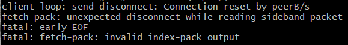

# Git Guidance

本指南旨在总结git的常用用法、可能遇到的问题及对应的解决方法

## git pull

git pull命令用于从另一个存储库或本地分支获取并集成(整合)。git pull命令的作用是：取回远程主机某个分支的更新，再与本地的指定分支合并，它的完整格式稍稍有点复杂。

```
git pull [options] [<repository> [<refspec>…]]
```

**描述**
将远程存储库中的更改合并到当前分支中。在默认模式下，git pull是git fetch后跟git merge FETCH_HEAD的缩写。
更准确地说，git pull使用给定的参数运行git fetch，并调用git merge将检索到的分支头合并到当前分支中。 使用–rebase，它运行git rebase而不是git merge。

**示例**

```
git pull <远程主机名> <远程分支名>:<本地分支名>
```

比如，要取回origin主机的next分支，与本地的master分支合并，需要写成下面这样 -

```
$ git pull origin next:master
```

如果远程分支(next)要与当前分支合并，则冒号后面的部分可以省略。上面命令可以简写为：

```
$ git pull origin next
```

上面命令表示，取回origin/next分支，再与当前分支合并。实质上，这等同于先做git fetch，再执行git merge。

```
$ git fetch origin
$ git merge origin/next
```

在某些场合，Git会自动在本地分支与远程分支之间，建立一种追踪关系(tracking)。比如，在git clone的时候，所有本地分支默认与远程主机的同名分支，建立追踪关系，也就是说，本地的master分支自动”追踪”origin/master分支。
Git也允许手动建立追踪关系。

```
$ git branch --set-upstream master origin/next
1
```

上面命令指定master分支追踪origin/next分支。
如果当前分支与远程分支存在追踪关系，git pull就可以省略远程分支名。

```
$ git pull origin
1
```

上面命令表示，本地的当前分支自动与对应的origin主机”追踪分支”(remote-tracking branch)进行合并。
如果当前分支只有一个追踪分支，连远程主机名都可以省略。

```
$ git pull
```

上面命令表示，当前分支自动与唯一一个追踪分支进行合并。
如果合并需要采用rebase模式，可以使用–rebase选项。

```
$ git pull --rebase <远程主机名> <远程分支名>:<本地分支名>
```

#### git fetch和git pull的区别

**git fetch**

git fetch：相当于是从远程获取最新版本到本地，不会自动合并。

```
$ git fetch origin master
$ git log -p master..origin/master
$ git merge origin/master
123
```

以上命令的含义：

首先从远程的origin的master主分支下载最新的版本到origin/master分支上然后比较本地的master分支和origin/master分支的差别最后进行合并
上述过程其实可以用以下更清晰的方式来进行：

```
$ git fetch origin master:tmp
$ git diff tmp 
$ git merge tmp
```

## git push

**git push** 命令用于从将本地的分支版本上传到远程并合并。

```
$ git push <远程主机名> <本地分支名>:<远程分支名>
```

如果本地分支名与远程分支名相同，则可以省略冒号：

```
$ git push <远程主机名> <本地分支名>
```

例子：

将本地的master分支内容推送到github远程仓库的main分支（github默认分支为main)

```
$ git push origin master:main
```

当然，也可以更改本地分支名字为main，这样就不用写冒号了

```
$ git checkout -m master main
$ git push origin main
```


## 将已有仓库push到远程仓库

1. 首先在当前文件夹创建本地git分支

```
$ git init
```

2. 然后连接远程仓库（远程仓库url一般使用ssh或http)

```
$ git remote add <远程仓库名> <远程仓库url>
```

3. **从远程仓库拉取文件（这一步很重要！）**

```
$ git pull origin <远程分支名>:<本地分支名>
```

4. 查看工作目录状态（可做可不做）

```
$ git status
```

5. 提交更改，添加备注信息

```
$ git add .
$ git commit -m "备注信息"
```

6. 将本地文件push到远程仓库

```
$ git push origin <本地分支名>:<远程分支名>
```

如果远程分支名和本地分支名相同

```
$ git pull origin <本地分支名>
```


## git 冲突

### 解决冲突一（有main分支操作权限）

如果你有main分支的权限，你可以使用这个办法。

一般冲突后会提示你解决的办法，也是此办法。

**更新远程分支**

这一步一般不做，大部分这两个分支本地都有，但是可能出现没有的情况，所以运行一下也没什么关系。

```
$ git fetch
```

**切换main分支、并拉取master分支代码**

```
$ git checkout main
$ git pull origin main
```

**拉取dev分支代码（当前分支是main）**

```
$ git pull origin dev
```

**解决冲突**

这一步手动解决冲突，解决后把<<<<和>>>>删掉

**提交代码**

```
# 添加全部的文件，这里为了演示方便，你可以添加具体的文件
$ git add .
# 提交代码到本地仓库
$ git commit -m '解决冲突'
# 提交代码到线上仓库
$ git push origin main
```


## git更改本地分支名字

假设分支名称为oldName
想要修改为 newName

### 本地分支重命名(还没有推送到远程)

```
$ git branch -m oldName newName
```

### 远程分支重命名 (已经推送远程-假设本地分支和远程对应分支名称相同)

a. 重命名远程分支对应的本地分支

```
$ git branch -m oldName newName
```


b. 删除远程分支

```
$ git push --delete origin oldName
```


c. 上传新命名的本地分支

```
$ git push origin newName
```

d. 把修改后的本地分支与远程分支关联

```
$ git branch --set-upstream-to origin/newName
```


注意：如果本地分支已经关联了远程分支，需要先解除原先的关联关系：

```
$ git branch --unset-upstream 
```


## Error

### failed to push some refs to 'github.com:xxxx2077/docs.git'


**问题原因：**远程库与本地库不一致造成的，在hint中也有提示把远程库同步到本地库就可以了
**解决办法：**

使用命令行：

```
$ git pull --rebase origin main
```

该命令的意思是把远程库中的更新合并到（pull=fetch+merge）本地库中，–-rebase的作用是取消掉本地库中刚刚的commit，并把他们接到更新后的版本库之中。出现如下图执行pull执行成功后，可以成功执行git push origin main操作。

```
$ git push origin main
```


### client_loop: send disconnect: Connection reset by peerB/s



**问题原因：传输文件太大，超出本地git客户端缓冲区大小**

当推送大量数据时（初始推送大型存储库，使用非常大的文件进行更改）可能需要 http.postBuffer 在 git 客户端 （而不是服务器）上设置更高的 设置 

**解决方法**

输入以下命令将 Git 缓冲区大小增加到 repo 的最大单个文件大小

```
git config --global http.postBuffer 157286400
```

