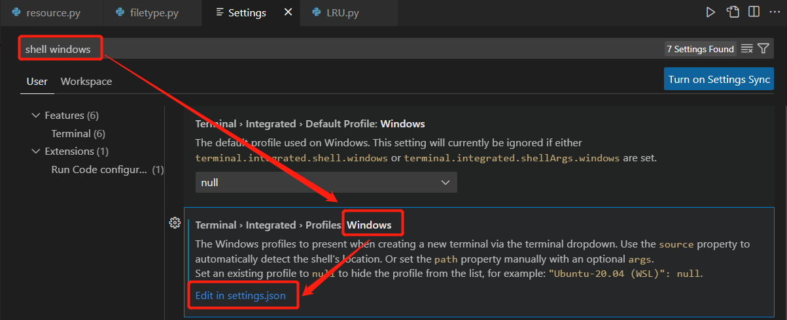

# Configure Guidance

## vscode配置git bash终端

左上角File->Preference->Settings，输入shell windows



点击Edit in settings.json，打开settings.json文件

更改前，我们可以看到以下界面


更改方法：**把Git Bash之间的空格去掉**，然后加入一行代码

```shell
"path": "D:\\Git\\bin\\bash.exe",
```

加入后为以下界面


关闭当前终端，快捷键ctrl+~打开新终端即可使用